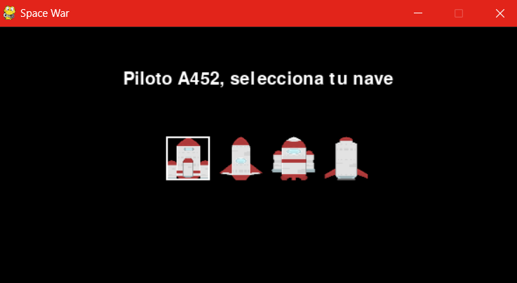
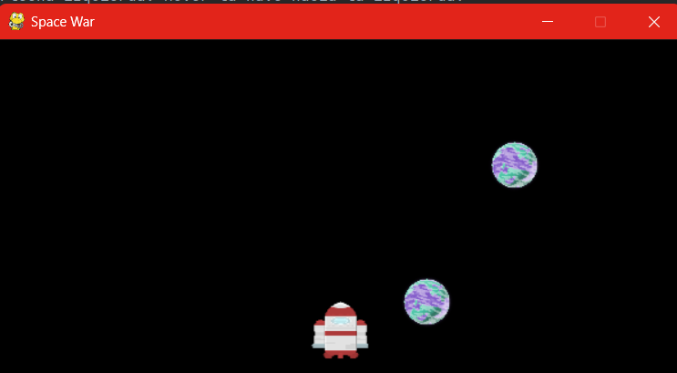

# Space War 


¡Bienvenido a Space Shooter! Este es un juego simple desarrollado con Pygame donde controlas una nave espacial y debes esquivar los objetos que caen del cielo.

## Objetivo del juego

El objetivo del juego es sobrevivir el mayor tiempo posible esquivando los objetos espaciales que caen desde arriba. Cada vez que tu nave colisiona con un objeto, pierdes, Intenta obtener la mayor puntuación posible antes de colisionar.

## Cómo jugar

1. Selecciona tu nave espacial.
2. Usa las teclas de flecha izquierda y derecha para mover tu nave.
3. Esquiva los objetos espaciales que caen desde arriba.
4. Sobrevive tanto tiempo como puedas y trata de obtener la mayor puntuación posible.

## Controles

Flecha izquierda: Mover la nave hacia la izquierda.
Flecha derecha: Mover la nave hacia la derecha.

## Capturas de pantalla





## Instalación

1. Clona este repositorio en tu máquina local.
2. Asegúrate de tener Python 3.9.5 y Pygame 2.5.2 instalados en tu sistema.
3. Configura un entorno virtual para el proyecto:
   
   ```bash
   python3 -m venv env
    ```
4. Activa el entorno virtual:

    En Windows:
   
   ```bash
    .\env\Scripts\activate 
    ```
    
    En macOS y Linux:
    ```bash 
    source env/bin/activate
   ```

5. Instala las dependencias del proyecto desde el archivo requirements.txt:

    ```bash 
    pip install -r requirements.txt
   ```

6. Ejecuta el juego utilizando el siguiente comando:

    ```bash 
    python main.py
   ```
   

¡Diviértete jugando!